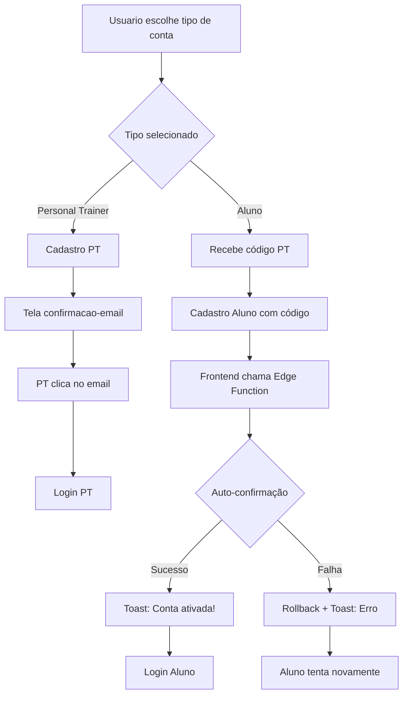

# Sistema de Autenticação - Titans Fitness

## 📋 Visão Geral

O sistema de autenticação do Titans Fitness utiliza o **Supabase Auth** com email como método principal de autenticação. Implementamos uma solução customizada para verificação seletiva de email baseada no tipo de usuário.

**Arquitetura Principal**: Todo aluno **deve** ter um Personal Trainer associado via código PT durante o cadastro.

## 🎯 Configuração Atual

### Supabase Auth Settings
- **Método de Autenticação**: Email
- **Confirm Email**: `HABILITADO` (obrigatório por padrão)
- **Provider**: Email nativo do Supabase

### Tipos de Usuário
- **Personal Trainer (PT)**: Requer verificação obrigatória de email
- **Aluno**: Verificação automática + **obrigatoriamente vinculado a um PT**

## ⚡ Problema Identificado

Por padrão, o Supabase obriga **todos os usuários** a verificar o email quando a opção "Confirm Email" está habilitada. Isso não atendia nosso requisito de negócio:

- ✅ **Personal Trainers**: Devem verificar email (maior segurança)
- ❌ **Alunos**: Não precisam verificar email (melhor UX) + **devem ter PT associado**

## 🚀 Solução Implementada: Edge Function + Chamada Direta

### Arquitetura da Solução



### Fluxo Completo do Processo

#### 1. **Convite do Personal Trainer**
```
PT logado → Tela "Convidar Aluno" → Edge Function envia email com código PT
```

#### 2. **Cadastro do Aluno**
```
Aluno → Recebe email → Acessa app → Informa código PT → Cadastro + Auto-confirmação
```

#### 3. **Auto-confirmação com Rollback**
```
Frontend → Edge Function → Auto-confirma OU Rollback (deleta usuário)
```

## 🗂️ Arquitetura Completa de Arquivos

### Frontend (React Native / Expo)
```
titans-fitness/
├── app/
│   ├── index.tsx                   # 🔐 Tela de login (PT e Aluno)
│   ├── tipo-conta.tsx              # 🎯 Escolha: PT ou Aluno
│   ├── cadastro-pt.tsx             # ✅ Cadastro Personal Trainer
│   ├── cadastro-aluno.tsx          # ✅ Cadastro Aluno (com código PT)
│   ├── confirmacao-email.tsx       # 📧 Verificação email (só PT)
│   ├── convite-aluno.tsx           # 📤 PT envia convites
│   │
│   └── (tabs)/
│       └── _layout.tsx             # 🧭 Navegação principal (PT/Aluno)
│
├── components/
│   └── GlobalAvatar.tsx            # 👤 Avatar universal (PT/Aluno)
│
├── hooks/
│   └── useAuth.tsx                 # 🛡️ Hook de autenticação
│
├── context/
│   └── AvatarContext.tsx           # 🔄 Context global do avatar
│
├── lib/
│   └── supabase.ts                 # 🔧 Configuração do cliente Supabase
│
└── docs/
    └── autenticacao.md             # 📚 Esta documentação
```

### Backend (Supabase)
```
supabase/
├── functions/
│   ├── handle-auth/                # 🤖 Edge Function principal
│   │   └── index.ts               # Auto-confirmação alunos + Rollback
│   │
│   └── enviar-convite/            # 📧 Edge Function emails
│       └── index.ts               # Envio convites PT→Aluno
```

### Database Schema Simplificado
```sql
-- Tabelas principais do sistema de autenticação
auth.users                     # 🔐 Usuários Supabase (built-in)
public.user_profiles           # 👤 Tipo de usuário (PT/Aluno)
public.personal_trainers       # 👨‍💼 Dados Personal Trainers
public.alunos                  # 👨‍🎓 Dados Alunos
```

### Configuração Necessária
```
Edge Functions:
├── handle-auth                # 🤖 Auto-confirmação + Rollback
└── enviar-convite            # 📧 Envio de emails

Email Provider:
└── Brevo SMTP                # 📧 Templates HTML integrados
```

## 🔧 Implementação Técnica

### 1. Convite do Personal Trainer (`convite-aluno.tsx`)

**Funcionalidades:**
- PT informa nome e email do aluno
- Sistema busca código PT automaticamente
- Envia email via Edge Function `enviar-convite`
- Toast de confirmação

**Código principal:**
```typescript
// Enviar convite via Database Function
const { data, error } = await supabase.functions.invoke('enviar-convite', {
  body: {
    nome_aluno: nomeAluno.trim(),
    email_aluno: emailAluno.toLowerCase().trim(),
    codigo_pt: ptData.codigo_pt,
    nome_personal: ptData.nome_completo
  }
});
```

### 2. Cadastro do Aluno (`cadastro-aluno.tsx`)

**Funcionalidades:**
- Aluno informa código PT (obrigatório)
- Validação automática do código (busca PT)
- Criação de usuário no Supabase Auth
- Geração automática de avatar baseado no nome
- Vinculação automática ao PT via `personal_trainer_id`

**Fluxo de validação:**
```typescript
// Buscar PT pelo código informado
const { data, error } = await supabase
  .from('personal_trainers')
  .select('id, nome_completo')
  .eq('codigo_pt', formData.codigoPT.toUpperCase())
  .single()
```

### 3. Edge Function: Auto-confirmação com Rollback (`handle-auth`)

**Localização**: `supabase/functions/handle-auth/index.ts`

**Status**: ✅ **IMPLEMENTADO E FUNCIONANDO**

**Funcionalidades implementadas:**
- ✅ **CORS configurado** corretamente
- ✅ **Validação de dados** obrigatórios (userId, userType)
- ✅ **Lógica diferenciada** por tipo de usuário
- ✅ **Rollback robusto** em todos os cenários de falha
- ✅ **Logs detalhados** para monitoramento
- ✅ **Tratamento de erros** completo

**Lógica implementada:**
```typescript
// Personal Trainer: Mantém verificação manual
if (userType === 'personal_trainer') {
  return { success: true, action: 'no_action' };
}

// Aluno: Auto-confirma email
if (userType === 'aluno') {
  const { error } = await supabaseAdmin.auth.admin.updateUserById(userId, {
    email_confirmed_at: new Date().toISOString()
  });
  
  if (error) {
    // ROLLBACK: Deletar usuário se falhar
    await supabaseAdmin.auth.admin.deleteUser(userId);
    return { success: false, rollback: true };
  }
  
  return { success: true, action: 'auto_confirmed' };
}
```

### 4. Chamada Direta da Edge Function

**No frontend (`cadastro-aluno.tsx`):**
```typescript
// Após criar usuário e perfis, chamar Edge Function
const { data: authResult, error } = await supabase.functions.invoke('handle-auth', {
  body: {
    userId: userId,
    userType: 'aluno'
  }
});

if (!authResult?.success) {
  // Rollback já foi feito na Edge Function
  throw new Error('Erro na ativação da conta. Tente novamente.');
}
```

## ✅ Processo Completo Documentado

### Arquivos Envolvidos no Fluxo

| Arquivo | Função | Usuário | Status |
|---------|--------|---------|--------|
| **Frontend - Autenticação** ||||
| `index.tsx` | 🔐 Tela de login | PT + Aluno | ✅ Implementado |
| `tipo-conta.tsx` | 🎯 Escolha tipo conta | PT + Aluno | ✅ Implementado |
| `cadastro-pt.tsx` | 👨‍💼 Cadastro PT | PT | ✅ Implementado |
| `cadastro-aluno.tsx` | 👨‍🎓 Cadastro Aluno | Aluno | ✅ Implementado |
| `confirmacao-email.tsx` | 📧 Verificação email | **Só PT** | ✅ Implementado |
| **Frontend - Fluxos** ||||
| `convite-aluno.tsx` | 📤 PT envia convites | PT | ✅ Implementado |
| `_layout.tsx` | 🧭 Navegação principal | PT + Aluno | ✅ Implementado |
| `index-pt.tsx` | 🏠 Dashboard PT | PT | ✅ Implementado |
| `index-aluno.tsx` | 🏠 Dashboard Aluno | Aluno | ✅ Implementado |
| **Frontend - Perfis** ||||
| `perfil-pt.tsx` | ⚙️ Perfil PT | PT | ✅ Implementado |
| `perfil-aluno.tsx` | ⚙️ Perfil Aluno | Aluno | ✅ Implementado |
| `AvatarSection.tsx` | 🖼️ Seção avatar | PT + Aluno | ✅ Implementado |
| **Backend - Edge Functions** ||||
| `handle-auth/index.ts` | 🤖 Auto-confirmação + rollback | Sistema | ✅ **IMPLEMENTADO** |
| `enviar-convite/index.ts` | 📧 Envio emails convite | Sistema | ⚠️ **Status a confirmar** |
| **Backend - Database** ||||
| `migrations/*.sql` | 🗄️ Schema database | Sistema | ⚠️ **Status a confirmar** |
| `policies/*.sql` | 🔒 RLS Policies | Sistema | ⚠️ **Status a confirmar** |

## 🎛️ Configurações Necessárias

### Supabase Dashboard
1. **Authentication** → **Settings** → **Confirm Email**: `ON`
2. **Edge Functions** → Deploy `handle-auth` ✅ e `enviar-convite` ⚠️
3. **Database** → **Migrations** ⚠️ (status a confirmar)

### Environment Variables
```env
SUPABASE_URL=https://[projeto].supabase.co
SUPABASE_SERVICE_ROLE_KEY=[service-role-key]
SMTP_HOST=[provedor-email]
SMTP_USER=[usuario-email]
SMTP_PASS=[senha-email]
```

### Database Policies
```sql
-- Política para Personal Trainers (verificação obrigatória)
CREATE POLICY "pt_verified_only" ON personal_trainers
  FOR ALL USING (
    auth.uid() = id AND 
    auth.jwt() ->> 'email_confirmed_at' IS NOT NULL
  );

-- Política para Alunos (acesso liberado + PT obrigatório)
CREATE POLICY "alunos_with_pt" ON alunos
  FOR ALL USING (
    auth.uid() = id AND 
    personal_trainer_id IS NOT NULL
  );
```

## 📊 Monitoramento

### Logs a Acompanhar
- ✅ Convites enviados com sucesso
- ✅ Cadastros com código PT válido
- ✅ Auto-confirmações realizadas
- ❌ Tentativas de cadastro sem PT
- ❌ Códigos PT inválidos

### Métricas Importantes
- **Taxa de conversão convite→cadastro**: Meta 70%+
- **Códigos PT válidos**: ~100% (validação obrigatória)
- **Auto-confirmação alunos**: ~100% (automática)
- **Tempo de ativação**: < 30 segundos

## 🚨 Regras de Negócio Críticas

### Validações Obrigatórias
1. **Aluno SEMPRE deve ter PT**: `personal_trainer_id NOT NULL`
2. **Código PT deve existir**: Validação em tempo real
3. **Email único por tipo**: Evitar duplicatas
4. **Avatar automático**: Gerado pelo nome no cadastro

### Segurança
- **PT verificação obrigatória**: Email confirmado manually
- **Aluno auto-confirmação**: Via Edge Function segura ✅
- **Admin API**: Apenas para Edge Functions ✅
- **RLS Policies**: Acesso controlado por tipo de usuário ⚠️

## 📚 Status de Implementação

### ✅ Concluído
- **Frontend completo**: Todas as telas e fluxos
- **Edge Function handle-auth**: Auto-confirmação + rollback
- **Lógica de negócio**: Validações e vinculação PT-Aluno
- **Sistema de avatars**: Geração automática

### ⚠️ A Confirmar Status
- **Edge Function enviar-convite**: Envio de emails
- **Database migrations**: Schema das tabelas
- **RLS Policies**: Segurança Row Level
- **Configuração SMTP**: Provider de emails

### 📋 Melhorias Futuras
- [ ] Templates de email customizados
- [ ] Retry logic para falhas
- [ ] Notificações push para PT
- [ ] Analytics de conversão
- [ ] Sistema de backup de dados
- [ ] Rate Limiting para Edge Functions
- [ ] Dashboard de monitoramento

---

**Atualizado em**: `15 de Julho de 2025`  
**Responsável**: Equipe de Desenvolvimento  
**Versão**: 1.1

**Status Geral**: 🟢 **Frontend e handle-auth implementados** | ⚠️ **Validar enviar-convite + database**