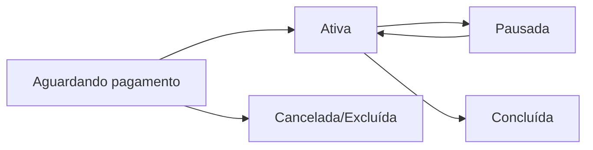

# 📋 Ciclo de Vida das Rotinas

Este documento detalha como funcionam os status das rotinas, suas regras de negócio, o processo de execução, envio de PDF por e-mail e arquivamento.

## 🏷️ Status de Rotina

### Estados Possíveis
- **`Aguardando pagamento`** - Rotina criada mas não paga pelo aluno
- **`Ativa`** - Rotina paga e em execução
- **`Pausada`** - Rotina temporariamente suspensa
- **`Concluída`** - Rotina finalizada (todas as sessões executadas)

### Fluxo de Status


## 🚦 Regras de Criação de Nova Rotina

### Quando NÃO é possível criar:
Uma nova rotina **não pode ser criada** se o aluno já possui uma rotina com status:
- `Aguardando pagamento`
- `Ativa` 
- `Pausada`

### Quando É possível criar:
- **Primeira rotina** do aluno
- Aluno possui apenas rotinas com status `Concluída` (que já foram arquivadas)

### Validação no Sistema
```typescript
// Verificar se pode criar nova rotina
const { data: rotinaAtiva } = await supabase
  .from('rotinas')
  .select('id')
  .eq('aluno_id', alunoId)
  .in('status', ['Aguardando pagamento', 'Ativa', 'Pausada'])
  .limit(1);

if (rotinaAtiva) {
  // Não pode criar nova rotina
  showError('Aluno já possui uma rotina ativa');
}
```

## ✅ Processo de Execução e Conclusão de Rotina

### Execução
- O aluno executa as sessões planejadas, registrando cada série e exercício realizado.
- O sistema permite registrar execuções diferentes do planejado (carga, repetições, etc).
- Todo o progresso é salvo em tempo real e pode ser acompanhado pelo personal.

### Envio de PDF por E-mail
- Ao ativar a rotina, o personal pode optar por enviar a rotina completa por e-mail para o aluno.
- O PDF é gerado automaticamente via Edge Function, sem ser armazenado, e enviado como anexo pelo sistema de e-mail (Brevo).
- O e-mail contém capa, resumo, treinos, exercícios, séries, instruções e contato do personal.

### Conclusão e Arquivamento
#### 1️⃣ Atualização do Aluno
```sql
UPDATE alunos 
SET ultimo_objetivo_rotina = 'Ganho de massa'
WHERE id = aluno_id;
```

#### 2️⃣ Geração do PDF Final
- PDF completo com todos os dados da rotina é gerado e enviado ao aluno.
- O PDF pode ser baixado pelo aluno a qualquer momento.

#### 3️⃣ Limpeza do Banco
```sql
-- Excluir todas as tabelas relacionadas (cascade)
DELETE FROM rotinas WHERE id = rotina_id;
-- Automatically deletes:
-- - treinos
-- - exercicios_rotina  
-- - series
-- - execucoes_sessao
```

#### 4️⃣ Registro de PDF
```sql
INSERT INTO rotinas_arquivadas (
  aluno_id, 
  objetivo,
  data_conclusao,
  pdf_url,
  nome_rotina,
  treinos_por_semana,
  duracao_semanas
) VALUES (...);
```

## 📱 Aba "Concluídas" - Interface do Aluno

### O que é exibido:
- Lista de rotinas arquivadas, com nome, objetivo, duração, frequência, data de conclusão e botão para baixar/ver PDF.

## 🎯 Lógica do Objetivo na Nova Rotina

### Ordem de Prioridade:
1. Objetivo salvo no storage (se usuário editou)
2. `ultimo_objetivo_rotina` do aluno (da rotina anterior)
3. `objetivo_principal` do onboarding (primeira rotina)
4. Campo vazio (fallback)

## 🗄️ Estratégia de Armazenamento

- Máximo 1 rotina ativa por aluno
- Todas as sessões e séries da rotina ativa
- Metadados das rotinas concluídas
- PDFs completos das rotinas concluídas (Cloudflare R2)
- Backup e versionamento automático

## 🏁 Fluxo Completo de Uso

### Exemplo de ciclo de vida:
1. João se cadastra → objetivo_principal: "Perda de peso"
2. PT cria rotina → objetivo preenchido: "Perda de peso"
3. João executa por 12 semanas
4. Rotina concluída → PDF gerado + banco limpo
5. alunos.ultimo_objetivo_rotina = "Perda de peso"

## 📊 Monitoramento e Métricas
- Taxa de conclusão de rotinas
- Tempo médio de execução
- Tamanho dos PDFs gerados
- Usage do Cloudflare R2

## 🛠️ Manutenção e Troubleshooting
- Logs de geração de PDF
- Retry automático em caso de falha
- Permitir regeneração manual do PDF

## 🔒 Segurança e Compliance
- PDFs criptografados em trânsito
- Access control por aluno/PT
- Logs de acesso aos PDFs
- Retention policy definida
- LGPD/GDPR: direito ao esquecimento, portabilidade, transparência