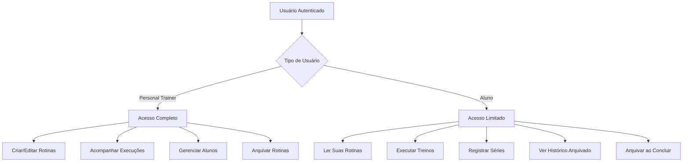
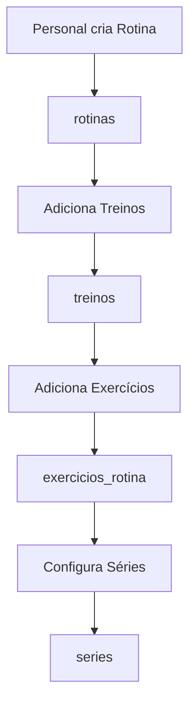
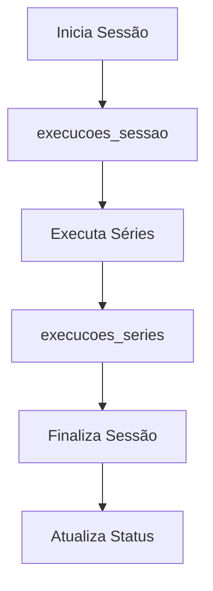
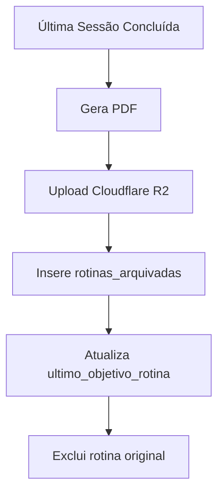

# 📋 Documentação - Estrutura de Tabelas do Sistema de Rotinas

## 🏟️ Visão Geral

O sistema de rotinas é composto por três principais categorias de tabelas:
- **Tabelas de Criação**: Para planejamento e estruturação das rotinas
- **Tabelas de Execução**: Para registro do que foi efetivamente executado
- **Tabelas de Arquivamento**: Para histórico de rotinas concluídas

---

## 📊 Tabelas de Criação da Rotina

### 1. `rotinas`
Informações gerais sobre a rotina criada pelo personal trainer.

| Campo | Tipo | Descrição |
|-------|------|-----------|
| `id` | uuid | Identificador único da rotina |
| `nome` | varchar | Nome da rotina |
| `descricao` | text | Descrição detalhada |
| `aluno_id` | uuid | ID do aluno |
| `personal_trainer_id` | uuid | ID do personal trainer |
| `treinos_por_semana` | integer | Frequência semanal |
| `dificuldade` | varchar | Nível de dificuldade |
| `duracao_semanas` | integer | Duração em semanas |
| `data_inicio` | date | Data de início |
| `valor_total` | numeric | Valor total da rotina |
| `forma_pagamento` | varchar | Forma de pagamento |
| `status` | varchar | Status atual |
| `observacoes_pagamento` | text | Observações sobre pagamento |
| `created_at` | timestamp | Data de criação |
| `permite_execucao_aluno` | boolean | Se aluno pode executar |
| `objetivo` | varchar | Objetivo da rotina |
| `pdf_email_enviado` | boolean | Indica se o PDF da rotina foi enviado por e-mail |

### 2. `treinos`
Treinos que compõem cada rotina.

| Campo | Tipo | Descrição |
|-------|------|-----------|
| `id` | uuid | Identificador único do treino |
| `rotina_id` | uuid | ID da rotina pai |
| `nome` | varchar | Nome do treino (ex: "Treino A") |
| `grupos_musculares` | text | Grupos musculares trabalhados |
| `ordem` | integer | Ordem do treino na rotina |
| `tempo_estimado_minutos` | integer | Tempo estimado |
| `observacoes` | text | Observações do treino |
| `created_at` | timestamp | Data de criação |

### 3. `exercicios_rotina`
Exercícios que compõem cada treino.

| Campo | Tipo | Descrição |
|-------|------|-----------|
| `id` | uuid | Identificador único |
| `treino_id` | uuid | ID do treino pai |
| `exercicio_1` | varchar | Nome do primeiro exercício |
| `exercicio_2` | varchar | Nome do segundo exercício (séries combinadas) |
| `intervalo_apos_exercicio` | integer | Intervalo após o exercício (segundos) |
| `observacoes` | text | Observações específicas |
| `ordem` | integer | Ordem do exercício no treino |
| `created_at` | timestamp | Data de criação |

### 4. `series`
Configuração das séries de cada exercício.

| Campo | Tipo | Descrição |
|-------|------|-----------|
| `id` | uuid | Identificador único |
| `exercicio_id` | uuid | ID do exercício pai |
| `numero_serie` | integer | Número da série |
| `repeticoes` | integer | Repetições planejadas (série simples) |
| `carga` | numeric | Carga planejada (série simples) |
| `tem_dropset` | boolean | Se a série tem dropset |
| `carga_dropset` | numeric | Carga reduzida para dropset |
| `observacoes` | text | Observações da série |
| `created_at` | timestamp | Data de criação |
| `intervalo_apos_serie` | integer | Intervalo após a série (segundos) |
| `repeticoes_1` | integer | Repetições do primeiro exercício (combinada) |
| `carga_1` | numeric | Carga do primeiro exercício (combinada) |
| `repeticoes_2` | integer | Repetições do segundo exercício (combinada) |
| `carga_2` | numeric | Carga do segundo exercício (combinada) |

---

## 🏃‍♂️ Tabelas de Execução

### 5. `execucoes_sessao`
Registro de cada sessão de treino executada.

| Campo | Tipo | Descrição |
|-------|------|-----------|
| `id` | uuid | Identificador único da execução |
| `rotina_id` | uuid | ID da rotina executada |
| `treino_id` | uuid | ID do treino executado |
| `aluno_id` | uuid | ID do aluno |
| `sessao_numero` | integer | Número da sessão |
| `data_execucao` | date | Data da execução |
| `status` | varchar | Status da execução |
| `tempo_total_minutos` | integer | Tempo total gasto |
| `observacoes` | text | Observações da sessão |
| `created_at` | timestamp | Data de criação |

### 6. `execucoes_series`
Registro do que foi efetivamente executado em cada série.

| Campo | Tipo | Descrição |
|-------|------|-----------|
| `id` | uuid | Identificador único |
| `execucao_sessao_id` | uuid | ID da sessão de execução |
| `exercicio_rotina_id` | uuid | ID do exercício da rotina |
| `serie_numero` | integer | Número da série executada |
| `repeticoes_executadas_1` | integer | Repetições executadas (ex. 1 ou simples) |
| `carga_executada_1` | numeric | Carga executada (ex. 1 ou simples) |
| `repeticoes_executadas_2` | integer | Repetições executadas (ex. 2 combinada) |
| `carga_executada_2` | numeric | Carga executada (ex. 2 combinada) |
| `carga_dropset` | numeric | Carga dropset executada |
| `observacoes` | text | Observações da execução |
| `created_at` | timestamp | Data de criação |

---

## 🗄️ Tabelas de Arquivamento

### 7. `rotinas_arquivadas`
Metadados das rotinas concluídas e arquivadas em PDF.

| Campo | Tipo | Descrição |
|-------|------|-----------|
| `id` | uuid | Identificador único |
| `aluno_id` | uuid | ID do aluno |
| `nome_rotina` | varchar | Nome da rotina conforme criada pelo PT |
| `objetivo` | varchar | Objetivo da rotina (Ganho de massa, Perda de peso, etc) |
| `treinos_por_semana` | integer | Frequência semanal de treinos |
| `duracao_semanas` | integer | Duração total da rotina em semanas |
| `data_conclusao` | date | Data em que a rotina foi concluída |
| `pdf_url` | text | URL do PDF arquivado no Cloudflare R2 |
| `created_at` | timestamp | Data de criação do registro |

### 8. `alunos` (coluna adicional)
Campo adicionado para suporte ao arquivamento.

| Campo | Tipo | Descrição |
|-------|------|-----------|
| `ultimo_objetivo_rotina` | varchar | Objetivo da última rotina concluída pelo aluno |

---

## 🏋️‍♂️ Tipos de Séries

### Séries Simples
- Armazenamento: `repeticoes` e `carga` na tabela `series`
- Execução: `repeticoes_executadas_1` e `carga_executada_1` na tabela `execucoes_series`
- Identificação: `exercicio_2` é nulo

**Exemplo**: 3 séries de 12 repetições com 20kg no Supino Reto

### Séries Simples com Dropset
- Armazenamento: `repeticoes`, `carga`, `tem_dropset = true`, `carga_dropset`
- Execução: Campos normais + `carga_dropset` preenchida
- Funcionamento: Executa série normal, depois continua com carga reduzida

**Exemplo**: 12 reps com 20kg + dropset com 15kg até a falha

### Séries Combinadas (Bi-set/Super-set)
- Armazenamento: `exercicio_1` e `exercicio_2` preenchidos, `repeticoes_1`, `carga_1`, `repeticoes_2`, `carga_2`
- Execução: `repeticoes_executadas_1`, `carga_executada_1`, `repeticoes_executadas_2`, `carga_executada_2`
- Identificação: `exercicio_2` não é nulo

**Exemplo**: Supino Reto (12 reps, 20kg) + Flexão (15 reps, peso corporal)

---

## 🔒 Segurança - Row Level Security (RLS)

O sistema utiliza **RLS (Row Level Security)** para controlar o acesso aos dados baseado no usuário autenticado.

### **📋 Tabelas de Criação - Acesso Restrito**

#### **Políticas para Personal Trainers:**
- **`pt_full_access`** em `rotinas` → ALL (completo acesso às suas rotinas)
- **`pt_manage_treinos`** em `treinos` → ALL (gerenciar treinos das suas rotinas)
- **`pt_manage_exercicios`** em `exercicios_rotina` → ALL (gerenciar exercícios)
- **`pt_manage_series`** em `series` → ALL (gerenciar séries)

#### **Políticas para Alunos:**
- **`aluno_read_only`** em `rotinas` → SELECT (ler apenas suas rotinas)
- **`aluno_read_treinos`** em `treinos` → SELECT (ler treinos das suas rotinas)
- **`aluno_read_exercicios`** em `exercicios_rotina` → SELECT (ler exercícios)
- **`aluno_read_series`** em `series` → SELECT (ler configuração das séries)

### **🏃‍♂️ Tabelas de Execução - Acesso Compartilhado**

#### **Políticas para Alunos:**
- **`aluno_manage_execucoes_sessao`** → ALL (gerenciar suas próprias execuções)
- **`aluno_manage_execucoes_series`** → ALL (registrar suas séries executadas)

#### **Políticas para Personal Trainers:**
- **`pt_read_execucoes_sessao`** → SELECT (acompanhar execuções dos alunos)
- **`pt_manage_execucoes_sessao`** → ALL (gerenciar execuções dos seus alunos)
- **`pt_read_execucoes_series`** → SELECT (acompanhar séries dos alunos)

### **📁 Tabelas de Arquivamento - Acesso Simplificado**

#### **Políticas para `rotinas_arquivadas`:**

```sql
-- Habilitar RLS
ALTER TABLE rotinas_arquivadas ENABLE ROW LEVEL SECURITY;

-- Alunos: ler suas próprias rotinas arquivadas
CREATE POLICY "aluno_read_own_rotinas_arquivadas" ON rotinas_arquivadas
    FOR SELECT USING (auth.uid() = aluno_id);

-- Alunos: inserir suas próprias rotinas arquivadas
CREATE POLICY "aluno_insert_own_rotinas_arquivadas" ON rotinas_arquivadas
    FOR INSERT WITH CHECK (auth.uid() = aluno_id);

-- PTs: ler rotinas arquivadas dos seus alunos
CREATE POLICY "pt_read_alunos_rotinas_arquivadas" ON rotinas_arquivadas
    FOR SELECT USING (
        EXISTS (
            SELECT 1 FROM alunos 
            WHERE alunos.id = rotinas_arquivadas.aluno_id 
            AND alunos.personal_trainer_id = auth.uid()
        )
    );

-- PTs: inserir rotinas arquivadas dos seus alunos
CREATE POLICY "pt_insert_alunos_rotinas_arquivadas" ON rotinas_arquivadas
    FOR INSERT WITH CHECK (
        EXISTS (
            SELECT 1 FROM alunos 
            WHERE alunos.id = rotinas_arquivadas.aluno_id 
            AND alunos.personal_trainer_id = auth.uid()
        )
    );
```

### **🔐 Lógica de Segurança**



### **⚡ Principais Condições RLS**

- **`auth.uid() = personal_trainer_id`** → PT acessa suas rotinas
- **`auth.uid() = aluno_id`** → Aluno acessa suas execuções/arquivos
- **`EXISTS (SELECT... WHERE rotinas.personal_trainer_id = auth.uid())`** → PT acessa dados dos seus alunos

---

## 🔄 Fluxo de Uso das Tabelas

### **1. Criação da Rotina (Personal Trainer)**



**Processo:**
1. Personal cria uma nova rotina em `rotinas`
2. Adiciona treinos (A, B, C...) em `treinos`
3. Para cada treino, adiciona exercícios em `exercicios_rotina`
4. Para cada exercício, configura séries em `series`

### **2. Execução da Rotina (Aluno ou Personal)**



**Processo:**
1. Inicia uma nova sessão em `execucoes_sessao`
2. Para cada série executada, registra em `execucoes_series`
3. Finaliza a sessão atualizando status e tempo total

### **3. Arquivamento da Rotina (Aluno ou Personal)**



**Processo:**
1. Quando a última sessão é concluída
2. Sistema gera PDF completo da rotina
3. Faz upload do PDF para Cloudflare R2
4. Insere metadados em `rotinas_arquivadas`
5. Atualiza `ultimo_objetivo_rotina` no perfil do aluno
6. Exclui a rotina original e todos os dados relacionados

### **4. Relacionamentos Importantes**

- **Planejado vs Executado**: Comparação entre tabelas `series` e `execucoes_series`
- **Histórico**: Múltiplas execuções da mesma rotina em datas diferentes
- **Progresso**: Evolução das cargas/repetições ao longo do tempo
- **Flexibilidade**: Possibilidade de executar com valores diferentes do planejado
- **Arquivamento**: Preservação do histórico via PDF + metadados essenciais

---

## 📈 Casos de Uso

### **Relatórios de Progresso**
- Comparar `carga` (planejada) vs `carga_executada_1` (real)
- Analisar evolução ao longo das sessões
- Identificar exercícios com maior/menor aderência

### **Análise de Performance**
- Tempo médio de execução por treino
- Taxa de conclusão das séries
- Eficácia dos dropsets e séries combinadas

### **Ajustes na Rotina**
- Usar dados de execução para ajustar cargas futuras
- Identificar exercícios que precisam de modificação
- Otimizar intervalos entre séries/exercícios

### **Gestão de Histórico**
- Visualizar rotinas anteriores via PDF
- Comparar objetivos entre diferentes períodos
- Acompanhar evolução geral do aluno ao longo do tempo

---

## 🛡️ Observações Técnicas

1. **Flexibilidade**: O sistema permite executar com valores diferentes do planejado
2. **Auditoria**: Todas as tabelas têm `created_at` para rastreabilidade
3. **Integridade**: Relacionamentos por UUIDs garantem consistência
4. **Escalabilidade**: Estrutura suporta múltiplos alunos e personal trainers
5. **Extensibilidade**: Fácil adição de novos tipos de séries ou métricas
6. **Segurança**: RLS garante que cada usuário acesse apenas seus dados permitidos
7. **Performance**: Políticas otimizadas após limpeza de redundâncias
8. **Arquivamento**: Sistema mantém histórico completo sem impactar performance
9. **Economia de Storage**: Rotinas antigas arquivadas em PDF liberam espaço no banco
10. **Continuidade**: Campo `ultimo_objetivo_rotina` permite criar novas rotinas baseadas no histórico